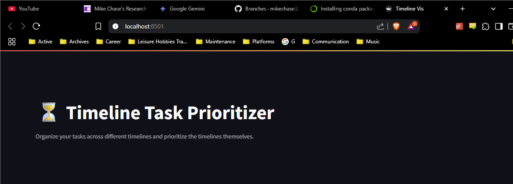

# Timeline Vis
* A timeline visualization application for project management.
* Pandas dataframes -> Streamlit most likely.

# Launching
* Configure a conda environment
  * `conda activate TimelineVis`
  * `conda init` may be needed before doing that.
  * There's no venv in this repo, just code. You'll make this.
* Install streamlit to your conda environment. 
* Put conda in your env:$PATH variable. Or microconda in my case.
  * For pycharm, add it again in Settings -> Tools -> Terminal -> Env variables
  * Should inherit from system vars, but maybe I changed system vars too late. Who knows; this fixed it.
* Run `streamlit run app.py` and it'll pop up on the dev server w/ a port and url.

# Pics
